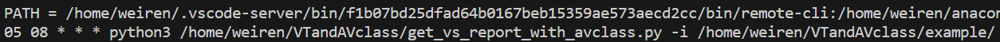

# AVClass + VirusTotal 自動化

- 首先先去VirusTotal的網站辦帳號，申請API KEY。建立完帳號，到自己的個人頁面之後就可以看到這個API Key了。
    
    
    
- 再來回到server，主要run的python檔是  “get_vs_report_with_avclass.py”
    
    需要輸入以下參數 -i -j -o -k，
    
    - -i = 要分析的malware資料夾
    - -j = 分析出malware的json要存放的資料夾
    - -o = 最後Output CSV的資料夾
    - -k = 是剛才申請的API Key
    - example:
        
        ```bash=
        get_vs_report_with_avclass.py -i /home/weiren/VTandAVclass/example/ -j /home/weiren/VTandAVclass/ -o /home/weiren/VTandAVclass/ -k 47eafd0e2a1ef32ae4ff854bd09397b130e8a027ff1e803074b2e23ff4daf020
        ```
        
- 之後使用crontab來控制每天自動run這隻程式
    - 在terminal 輸入 `echo $PATH` ，把這串PATH複製起來 等等要用
        
        
        
    - 然後在terminal 輸入 `crontab -e` 進到編輯頁面
    - 在最底下加入 PATH = “剛剛複製的path”
    - 然後再下一行打上
        
        ```bash=
        05 08 * * * python get_vs_report_with_avclass.py -i /home/weiren/VTandAVclass/example/ -j /home/weiren/VTandAVclass/ -o /home/weiren/VTandAVclass/ -k 47eafd0e2a1ef32ae4ff854bd09397b130e8a027ff1e803074b2e23ff4daf020
        ```
        
    - 代表著每天早上的8點5分，會自動啟動此程式，時間就看自己要設多少都行，
    - 所以加入的兩行會如下:

        ```bash=
        PATH = /home/weiren/.vscode-server/bin/f1b07bd25dfad64b0167beb15359ae573aecd2cc/bin/remote-cli:/home/weiren/anaconda3/bin:/home/weiren/anaconda3/condabin:/opt/gradle/gradle-8.2.1/bin:/usr/local/sbin:/usr/local/bin:/usr/sbin:/usr/bin:/sbin:/bin:/usr/games:/usr/local/games:/snap/bin
        05 08 * * * python3 /home/weiren/VTandAVclass/get_vs_report_with_avclass.py -i /home/weiren/VTandAVclass/example/ -j /home/weiren/VTandAVclass/json_file/ -o /home/weiren/VTandAVclass/ -k bb471ca1b828aef1fe3eed4ad30abb503b5c3af50c0beadcc5b531af824fba88 >> /home/weiren/VTandAVclass/example.py.log 2>&1
        ```

        
        
    - 弄好之後就儲存退出。
    - 設定完crontab之後，可以用 `crontab -l` 來檢查是否有寫入成功。
    - 如果有成功，就只需要等待自己設定的時間到了，就會自動啟動程式。
    - 那預期的output應該會有一個avclassOutput.csv跟每一隻分析過後的malware的json檔。
    - 那要自己去看一下說Input的資料夾大概有幾個malware，一天可以跑250隻file，所以就算一下幾天後要更新crontab(程式要分析的資料夾)。